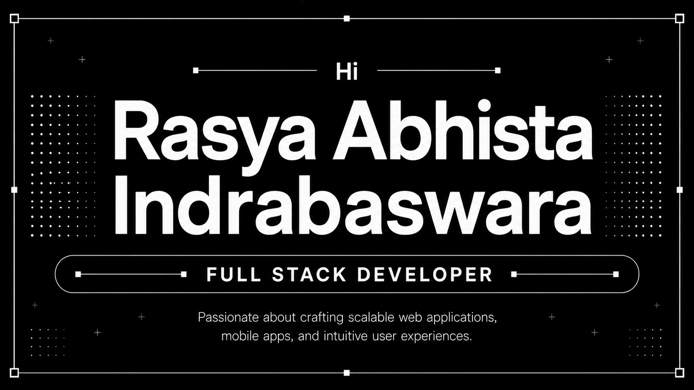

<div align="center">

  

  <br/><br/>

  ```
  ██████╗  █████╗ ███████╗██╗   ██╗ █████╗ 
  ██╔══██╗██╔══██╗██╔════╝╚██╗ ██╔╝██╔══██╗
  ██████╔╝███████║███████╗ ╚████╔╝ ███████║
  ██╔══██╗██╔══██║╚════██║  ╚██╔╝  ██╔══██║
  ██║  ██║██║  ██║███████║   ██║   ██║  ██║
  ╚═╝  ╚═╝╚═╝  ╚═╝╚══════╝   ╚═╝   ╚═╝  ╚═╝
  ```

</div>

<br/>

## 👋 About Me

Computer Science Undergraduate at **Universitas Multimedia Nusantara** with interests in **Full Stack Web Development**, **Mobile Application Development**, **UI/UX Design**, and **Artificial Intelligence**.

Experienced in developing academic and personal projects using **React Native**, **Laravel**, **Supabase**, **PHP**, and **JavaScript**. Passionate about creating user-centered digital solutions and continuously improving technical skills through projects and certifications.

<br/>

## 🔗 Connect With Me

<div align="center">

  <a href="mailto:rasyabaswara7@gmail.com">
    
  </a>
  <a href="https://www.linkedin.com/in/rasya-abhista-indrabaswara-5b953228a/" target="_blank">
    
  </a>
  <a href="https://www.instagram.com/rasya_abhista" target="_blank">
    
  </a>
  <a href="https://discord.com/users/rasya6469" target="_blank">
    
  </a>
  

</div>

<br/>

## 🛠️ Technical Skills

<div align="center">

  
  
  
  
  
  
  
  
  
  
  
  
  
  
  
  
  
  
  

</div>

<br/>

## 📊 GitHub Stats

<div align="center">

  
  

  <br/>

  

  <br/>

  

</div>

<br/>

<div align="center">

  ```
  ████████╗██╗  ██╗ █████╗ ███╗   ██╗██╗  ██╗    ██╗   ██╗ ██████╗ ██╗   ██╗
  ╚══██╔══╝██║  ██║██╔══██╗████╗  ██║██║ ██╔╝    ╚██╗ ██╔╝██╔═══██╗██║   ██║
     ██║   ███████║███████║██╔██╗ ██║█████╔╝      ╚████╔╝ ██║   ██║██║   ██║
     ██║   ██╔══██║██╔══██║██║╚██╗██║██╔═██╗       ╚██╔╝  ██║   ██║██║   ██║
     ██║   ██║  ██║██║  ██║██║ ╚████║██║  ██╗       ██║   ╚██████╔╝╚██████╔╝
     ╚═╝   ╚═╝  ╚═╝╚═╝  ╚═╝╚═╝  ╚═══╝╚═╝  ╚═╝       ╚═╝    ╚═════╝  ╚═════╝
  ```

</div>
